# FeedbackIQ 🚀

<div align="center">


**AI-Powered Feedback Prioritization for Product Teams**

[](https://reactjs.org/)
[](https://www.typescriptlang.org/)
[](https://supabase.com/)
[](https://tailwindcss.com/)
[](LICENSE)

[Features](#features) • [Demo](#demo) • [Installation](#installation) • [Documentation](#documentation) • [Contributing](#contributing)

</div>

---

## 📋 Table of Contents

- [Overview](#overview)
- [Features](#features)
- [Architecture](#architecture)
- [Technology Stack](#technology-stack)
- [Database Schema](#database-schema)
- [Getting Started](#getting-started)
- [Configuration](#configuration)
- [Usage Guide](#usage-guide)
- [API Documentation](#api-documentation)
- [Integrations](#integrations)
- [Contributing](#contributing)
- [License](#license)

---

## 🎯 Overview

**FeedbackIQ** is an intelligent feedback management platform that helps product teams collect, analyze, and prioritize customer feedback using AI. It transforms unstructured feedback into actionable insights, helping teams make data-driven decisions about product development.

### Why FeedbackIQ?

- **AI-Powered Analysis**: Automatically categorize, score, and extract insights from feedback
- **Smart Prioritization**: Calculate priority scores based on impact, urgency, and frequency
- **Multi-Source Collection**: Aggregate feedback from surveys, in-app submissions, social media, support tickets, and email
- **Team Collaboration**: Assign feedback, add notes, and track progress across your team
- **Advanced Analytics**: Visualize trends, sentiment, and patterns in your feedback data
- **Seamless Integrations**: Sync with Notion, Slack, Zapier, and Jira (coming soon)

---

## ✨ Features

### 🤖 AI-Powered Intelligence

- **Automatic Categorization**: AI classifies feedback into predefined categories (Bug, Feature Request, UX Issue, etc.)
- **Sentiment Analysis**: Detects positive, neutral, or negative sentiment
- **Urgency Detection**: Identifies high, medium, or low urgency based on customer language
- **Impact Scoring**: Calculates business impact on a 1-10 scale
- **Theme Extraction**: Automatically identifies key themes and topics
- **Priority Calculation**: Smart algorithm combines impact, urgency, and frequency

### 📊 Analytics Dashboard

- **Real-time Statistics**: Track total feedback, average priority scores, and pending items
- **Category Distribution**: Pie chart showing feedback breakdown by category
- **Urgency Analysis**: Bar chart displaying urgency levels
- **Sentiment Trends**: Line chart tracking sentiment over time
- **Customer Segment Analysis**: Understand which segments report which issues
- **Theme Analytics**: Identify most mentioned themes across all feedback

### 🔄 Feedback Management

- **Multi-Source Collection**: Support for Survey, In-App, Social Media, Support Ticket, and Email sources
- **Bulk Import**: CSV upload for importing multiple feedback items at once
- **Advanced Filtering**: Filter by source, category, urgency, sentiment, customer segment, status, and date range
- **Status Tracking**: New → In Review → Planned → In Progress → Completed → Rejected
- **Team Assignment**: Assign feedback items to team members
- **Notes & Comments**: Add internal notes and collaboration comments

### 📈 Priority View

- **Top Priority List**: Automatically surfaces the most critical feedback
- **Grouped View**: See feedback grouped by category with counts
- **Similar Requests**: Track how many customers are asking for the same thing
- **Quick Actions**: Update status, assign team members, and add notes inline

### 🔗 Integrations

FeedbackIQ seamlessly connects with your favorite tools to streamline your feedback workflow.

#### ✅ Notion Integration (Active)
- **Two-way Sync**: Automatically sync high-priority feedback to Notion databases
- **Customizable Filters**: Choose which feedback to sync based on priority score
- **Manual & Auto Sync**: Trigger syncs manually or set up automatic syncing
- **Rich Data Mapping**: Syncs all relevant fields including category, priority, sentiment, and more
- **Sync History**: Track all sync operations with detailed logs

#### ✅ Slack Integration (Active)
- **Real-time Notifications**: Get instant alerts when high-priority feedback is detected
- **Customizable Triggers**: Set priority thresholds for notifications
- **Rich Formatting**: Beautiful message formatting with all feedback details
- **Channel Selection**: Choose which channel receives notifications

#### ✅ Zapier Integration (Active)
- **5,000+ Apps**: Connect FeedbackIQ with Gmail, Trello, Asana, HubSpot, and more
- **Flexible Triggers**: Send all feedback or only high-priority items
- **Webhook-Based**: Simple webhook integration with any Zapier Zap
- **Custom Workflows**: Build complex automation workflows

#### ✅ Jira Integration (Active)
- **Auto-Create Tickets**: Automatically create Jira issues from high-priority feedback
- **Customizable Mapping**: Configure issue type, project, and default assignee
- **Priority Sync**: Feedback priority scores map to Jira priorities
- **Bi-directional Linking**: Track Jira ticket keys in feedback notes
- **Jira**: Auto-create tickets from feedback

---

## 🏗️ Architecture

### System Architecture


### Data Flow


### Priority Score Calculation

```mermaid
graph LR
    A[Impact Score 1-10] -->|×10| D[Priority Score]
    B[Urgency High/Med/Low] -->|×5| D
    C[Similar Requests Count] --> D
    
    style D fill:#7c3aed
```



---

## 🛠️ Technology Stack

### Frontend
- **React 18.3.1**: Modern UI library with hooks
- **TypeScript 5.x**: Type-safe JavaScript
- **Vite**: Lightning-fast build tool
- **Tailwind CSS 3.x**: Utility-first CSS framework
- **shadcn/ui**: High-quality component library
- **React Router 6**: Client-side routing
- **TanStack Query**: Data fetching and caching
- **Recharts**: Data visualization library
- **date-fns**: Modern date utility library

### Backend
- **Supabase Cloud**: Backend-as-a-Service
- **PostgreSQL**: Relational database
- **Row Level Security**: Database-level authorization
- **Edge Functions**: Serverless functions (Deno)

### AI & Analytics
- **Lovable AI Gateway**: AI model access
- **Google Gemini 2.5 Flash**: Fast, efficient AI model
- **Natural Language Processing**: Sentiment and category analysis

### DevOps
- **Git**: Version control
- **Lovable Cloud**: Deployment platform
- **GitHub**: Code repository (optional)

---

## 💾 Database Schema

### Tables

#### `profiles`
User profile information linked to authentication.

```sql
CREATE TABLE profiles (
  id UUID PRIMARY KEY REFERENCES auth.users(id),
  email TEXT NOT NULL,
  full_name TEXT,
  avatar_url TEXT,
  organization_id UUID NOT NULL DEFAULT gen_random_uuid(),
  created_at TIMESTAMP WITH TIME ZONE DEFAULT NOW(),
  updated_at TIMESTAMP WITH TIME ZONE DEFAULT NOW()
);
```

#### `feedback`
Core feedback data with AI-generated insights.

```sql
CREATE TABLE feedback (
  id UUID PRIMARY KEY DEFAULT gen_random_uuid(),
  organization_id UUID NOT NULL,
  user_id UUID NOT NULL REFERENCES auth.users(id),
  feedback_text TEXT NOT NULL,
  source TEXT NOT NULL, -- Survey, In-App, Social Media, Support Ticket, Email
  customer_name TEXT,
  customer_email TEXT,
  customer_segment TEXT NOT NULL, -- Enterprise, Pro, Free, Trial
  category TEXT, -- AI-generated
  urgency TEXT, -- AI-generated: High, Medium, Low
  sentiment TEXT, -- AI-generated: Positive, Neutral, Negative
  impact_score INTEGER, -- AI-generated: 1-10
  priority_score INTEGER, -- Calculated
  key_themes TEXT[], -- AI-generated array
  status TEXT NOT NULL DEFAULT 'New',
  assigned_to TEXT,
  notes TEXT,
  created_at TIMESTAMP WITH TIME ZONE DEFAULT NOW(),
  updated_at TIMESTAMP WITH TIME ZONE DEFAULT NOW()
);
```

#### `team_members`
Team collaboration and assignment tracking.

```sql
CREATE TABLE team_members (
  id UUID PRIMARY KEY DEFAULT gen_random_uuid(),
  organization_id UUID NOT NULL,
  user_id UUID NOT NULL REFERENCES auth.users(id),
  name TEXT NOT NULL,
  email TEXT NOT NULL,
  created_at TIMESTAMP WITH TIME ZONE DEFAULT NOW()
);
```

#### `integration_settings`
Store integration credentials and configuration.

```sql
CREATE TABLE integration_settings (
  id UUID PRIMARY KEY DEFAULT gen_random_uuid(),
  user_id UUID NOT NULL REFERENCES auth.users(id),
  integration_type TEXT NOT NULL,
  api_key TEXT,
  database_id TEXT,
  settings JSONB DEFAULT '{}'::jsonb,
  is_active BOOLEAN DEFAULT false,
  last_sync_at TIMESTAMP WITH TIME ZONE,
  created_at TIMESTAMP WITH TIME ZONE DEFAULT NOW(),
  updated_at TIMESTAMP WITH TIME ZONE DEFAULT NOW(),
  UNIQUE(user_id, integration_type)
);
```

#### `sync_history`
Track integration sync operations.

```sql
CREATE TABLE sync_history (
  id UUID PRIMARY KEY DEFAULT gen_random_uuid(),
  user_id UUID NOT NULL REFERENCES auth.users(id),
  integration_type TEXT NOT NULL,
  sync_type TEXT NOT NULL,
  items_synced INTEGER DEFAULT 0,
  status TEXT NOT NULL,
  error_details TEXT,
  created_at TIMESTAMP WITH TIME ZONE DEFAULT NOW()
);
```

### Row Level Security (RLS)

All tables have RLS enabled with organization-based isolation:

```sql
-- Users can only access data in their organization
CREATE POLICY "org_isolation" ON feedback
  FOR ALL USING (
    organization_id IN (
      SELECT organization_id FROM profiles WHERE id = auth.uid()
    )
  );
```

### Entity Relationship Diagram


---

## 🚀 Getting Started

### Prerequisites

- Node.js 18+ and npm/yarn/bun
- Supabase account (or use Lovable Cloud)
- Modern web browser

### Installation

1. **Clone the repository**
   ```bash
   git clone <YOUR_GIT_URL>
   cd feedbackiq
   ```

2. **Install dependencies**
   ```bash
   npm install
   # or
   yarn install
   # or
   bun install
   ```

3. **Set up environment variables**
   
   The `.env` file is auto-generated by Lovable Cloud. If you're self-hosting:
   
   ```env
   VITE_SUPABASE_URL=your_supabase_url
   VITE_SUPABASE_PUBLISHABLE_KEY=your_publishable_key
   VITE_SUPABASE_PROJECT_ID=your_project_id
   ```

4. **Run database migrations**
   
   Migrations are automatically applied when using Lovable Cloud. For self-hosting, run:
   ```bash
   supabase db push
   ```

5. **Start the development server**
   ```bash
   npm run dev
   ```

6. **Open your browser**
   
   Navigate to `http://localhost:5173`

### Quick Start Guide

1. **Sign Up**: Create your account at `/auth`
2. **Add Feedback**: Click "Add Feedback" to submit your first item
3. **Analyze**: Click the sparkle icon to analyze with AI
4. **Explore**: View analytics, priority scores, and insights
5. **Integrate**: Connect Notion to sync your feedback

---

## ⚙️ Configuration

### Authentication Setup

FeedbackIQ uses Supabase Auth with email/password authentication. Email confirmation is disabled for faster testing.

To enable email confirmation:
```sql
-- In Supabase dashboard or via migration
UPDATE auth.config SET confirm_email = true;
```

### AI Model Configuration

The app uses Google Gemini 2.5 Flash through Lovable AI Gateway. The API key is pre-configured in Lovable Cloud environments.

Model: `google/gemini-2.5-flash` (default, free during promotional period)

### Priority Score Weights

Customize the priority calculation in `supabase/functions/analyze-feedback/index.ts`:

```typescript
const urgencyWeight = urgency === "High" ? 3 : urgency === "Medium" ? 2 : 1;
const priorityScore = (impactScore * 10) + (urgencyWeight * 5) + frequencyBonus;
```

### Notion Integration

1. Create a Notion integration at [notion.so/my-integrations](https://notion.so/my-integrations)
2. Create a database in Notion with the following properties:
   - Title (title)
   - Category (select)
   - Priority Score (number)
   - Urgency (select)
   - Impact Score (number)
   - Sentiment (select)
   - Customer Segment (select)
   - Status (select)
   - Source (select)
   - Created Date (date)
3. Share the database with your integration
4. Copy the database ID from the URL
5. Add credentials in FeedbackIQ → Integrations → Connect Notion

---

## 📖 Usage Guide

### Adding Feedback

**Manual Entry:**
1. Click "Add Feedback" button
2. Fill in the form:
   - Feedback text (required)
   - Source (dropdown)
   - Customer name (optional)
   - Customer email (optional)
   - Customer segment (dropdown)
3. Click "Submit"

**Bulk Import via CSV:**
1. Prepare CSV with columns: `feedback_text`, `source`, `customer_name`, `customer_email`, `customer_segment`
2. Click "Bulk Import CSV"
3. Select your file
4. Review imported items

### Analyzing Feedback

**Single Analysis:**
1. Find feedback item in list
2. Click sparkle icon (⚡)
3. Wait for AI analysis (5-10 seconds)

**Batch Analysis:**
1. Click "Analyze All Unanalyzed" button
2. Monitor progress bar
3. Results appear automatically

### Priority Management

**View Top Priorities:**
1. Navigate to "Priority View"
2. See top 10 items sorted by score
3. Color coding:
   - Red (80-100): Critical
   - Orange (60-79): High
   - Yellow (40-59): Medium
   - Green (0-39): Low

**Update Status:**
1. Use dropdown on priority cards
2. Options: New → In Review → Planned → In Progress → Completed → Rejected

**Assign Team Members:**
1. Use "Assign to" dropdown
2. Select team member
3. Updates immediately

### Filtering & Search

**Filter Panel:**
1. Click filter icon in top bar
2. Select multiple criteria:
   - Date range
   - Categories
   - Sources
   - Priority range
   - Urgency levels
   - Segments
   - Status
3. Click "Apply Filters"

**Global Search:**
- Use search bar in top navigation
- Searches feedback text, customer names, themes, and notes
- Results highlight matching text

### Analytics

**Available Charts:**
- Category Breakdown (pie chart)
- Urgency Distribution (bar chart)
- Sentiment Trend (line chart over time)
- Top Themes (horizontal bar chart)
- Customer Segment Analysis (stacked bar)

**Date Range:**
- Default: Last 30 days
- Customize via date picker

### Syncing to Notion

**Setup:**
1. Go to Integrations page
2. Click "Connect Notion"
3. Enter API key from [notion.so/my-integrations](https://www.notion.so/my-integrations)
4. Enter Notion database ID (from database URL)
5. Click "Test Connection"
6. Configure sync settings:
   - Enable auto-sync for high-priority items
   - Set minimum priority score (default: 80)
7. Activate integration

**Manual Sync:**
1. Click "Sync Now" button
2. Monitor progress
3. Check sync history for details

**Auto Sync:**
- Enable "Auto-sync high priority items"
- Set minimum priority threshold
- Items automatically sync when they meet criteria

### Slack Notifications

**Setup:**
1. Go to Integrations page
2. Click "Connect Slack"
3. Create an Incoming Webhook in Slack:
   - Go to [api.slack.com/messaging/webhooks](https://api.slack.com/messaging/webhooks)
   - Click "Create New App" → "From scratch"
   - Add "Incoming Webhooks" feature
   - Activate and create webhook
4. Copy webhook URL and paste in FeedbackIQ
5. Click "Test Connection" to verify
6. Configure notification settings:
   - Enable notifications for high-priority feedback
   - Set minimum priority score (default: 80)
   - Optional: Set specific channel name
7. Activate integration

**What Gets Notified:**
- High-priority feedback (above your threshold)
- Feedback details including priority score, urgency, category
- Customer information if available
- Direct link to view in FeedbackIQ

### Zapier Automation

**Setup:**
1. Create a new Zap at [zapier.com](https://zapier.com)
2. Choose "Webhooks by Zapier" as trigger
3. Select "Catch Hook" as trigger event
4. Copy the webhook URL provided by Zapier
5. Go to FeedbackIQ Integrations page
6. Click "Connect Zapier"
7. Paste webhook URL
8. Click "Test Connection"
9. Configure trigger settings:
   - **Trigger on new feedback**: Send all new feedback items
   - **Trigger on high priority**: Only send high-priority items
   - Set minimum priority score (default: 80)
10. Activate integration
11. Return to Zapier and configure your action (e.g., create Trello card, send email, etc.)

**Popular Zapier Workflows:**
- **Gmail**: Email high-priority feedback to your team
- **Trello**: Create cards for each feedback item
- **Google Sheets**: Log all feedback to a spreadsheet
- **Asana**: Create tasks for feature requests
- **HubSpot**: Add feedback to CRM contacts
- **Microsoft Teams**: Post notifications to channels

### Jira Ticket Creation

**Setup:**
1. Create Jira API token:
   - Go to [id.atlassian.com/manage-profile/security/api-tokens](https://id.atlassian.com/manage-profile/security/api-tokens)
   - Click "Create API token"
   - Copy the token
2. Go to FeedbackIQ Integrations page
3. Click "Connect Jira"
4. Fill in:
   - **Jira Domain**: yourcompany.atlassian.net (without https://)
   - **Email**: Your Jira account email
   - **API Token**: Token from step 1
   - **Project Key**: Your Jira project key (e.g., PROJ, FB)
5. Click "Test Connection" to verify
6. Configure ticket settings:
   - Enable auto-create for high-priority feedback
   - Set minimum priority score (default: 80)
   - Choose issue type (Task, Bug, Story, Epic)
   - Optional: Set default assignee
7. Activate integration

**Ticket Details:**
- **Summary**: [Feedback] Category - Priority Score
- **Description**: Full feedback text with metadata
- **Labels**: feedback, priority-XX, urgency-level
- **Link**: Feedback ID stored in notes for tracking

---

## 🔌 API Documentation

### Edge Functions

#### `analyze-feedback`

Analyzes feedback text using AI to extract category, urgency, sentiment, impact score, and key themes.

**Endpoint:** `POST /functions/v1/analyze-feedback`

**Request:**
```json
{
  "feedbackId": "uuid",
  "feedbackText": "string",
  "customerSegment": "Enterprise" | "Pro" | "Free" | "Trial"
}
```

**Response:**
```json
{
  "category": "Bug" | "Feature Request" | "UX Issue" | ...,
  "urgency": "High" | "Medium" | "Low",
  "sentiment": "Positive" | "Neutral" | "Negative",
  "impact_score": 1-10,
  "key_themes": ["theme1", "theme2", ...],
  "priority_score": 0-100
}
```

#### `sync-to-notion`

Syncs feedback items to Notion database.

**Endpoint:** `POST /functions/v1/sync-to-notion`

**Request (Test Connection):**
```json
{
  "action": "test",
  "api_key": "secret_xxx",
  "database_id": "abc123..."
}
```

**Request (Sync):**
```json
{
  "action": "sync",
  "min_priority_score": 80
}
```

**Response:**
```json
{
  "success": true,
  "items_synced": 15,
  "database_name": "Feedback Database" // for test
}
```

#### `notify-slack`

Sends Slack notifications for high-priority feedback.

**Endpoint:** `POST /functions/v1/notify-slack`

**Request (Test Connection):**
```json
{
  "action": "test",
  "webhook_url": "https://hooks.slack.com/services/..."
}
```

**Request (Send Notification):**
```json
{
  "action": "notify",
  "webhook_url": "https://hooks.slack.com/services/...",
  "feedback": {
    "id": "uuid",
    "feedback_text": "string",
    "priority_score": 85,
    "urgency": "High",
    "category": "Feature Request",
    "source": "In-App",
    "customer_name": "John Doe",
    "customer_email": "john@example.com"
  }
}
```

**Response:**
```json
{
  "success": true
}
```

#### `sync-to-jira`

Creates Jira tickets from high-priority feedback.

**Endpoint:** `POST /functions/v1/sync-to-jira`

**Request (Test Connection):**
```json
{
  "action": "test",
  "domain": "yourcompany.atlassian.net",
  "email": "your@email.com",
  "api_token": "your_token",
  "project_key": "PROJ"
}
```

**Request (Create Ticket):**
```json
{
  "action": "create",
  "domain": "yourcompany.atlassian.net",
  "email": "your@email.com",
  "api_token": "your_token",
  "project_key": "PROJ",
  "issue_type": "Task",
  "feedback": {
    "id": "uuid",
    "feedback_text": "string",
    "priority_score": 85,
    "urgency": "High",
    "category": "Feature Request",
    "source": "In-App",
    "customer_name": "John Doe",
    "customer_email": "john@example.com"
  }
}
```

**Response:**
```json
{
  "success": true,
  "issue_key": "PROJ-123",
  "issue_url": "https://yourcompany.atlassian.net/browse/PROJ-123"
}
```

### Database Queries

#### Get Feedback with Filters

```typescript
const { data, error } = await supabase
  .from('feedback')
  .select('*')
  .eq('organization_id', orgId)
  .gte('priority_score', 60)
  .order('priority_score', { ascending: false })
  .limit(20);
```

#### Insert Feedback

```typescript
const { data, error } = await supabase
  .from('feedback')
  .insert({
    organization_id: orgId,
    user_id: userId,
    feedback_text: 'User feedback here',
    source: 'In-App',
    customer_segment: 'Pro'
  });
```

#### Update Feedback Analysis

```typescript
const { data, error } = await supabase
  .from('feedback')
  .update({
    category: 'Bug',
    urgency: 'High',
    sentiment: 'Negative',
    impact_score: 8,
    priority_score: 95,
    key_themes: ['crash', 'data loss']
  })
  .eq('id', feedbackId);
```

---

## 🔗 Integrations

### Current Integrations

#### Notion ✅

Sync feedback to Notion databases for enhanced team collaboration.

**Features:**
- Test connection before saving
- Manual and automatic syncing
- Customizable sync filters
- Detailed sync history
- Full field mapping

**Setup Guide:**
See [Configuration → Notion Integration](#notion-integration)

### Coming Soon

#### Slack 🚧
- Real-time notifications for high-priority feedback
- Slash commands for quick feedback submission
- Daily digest of top items

#### Zapier 🚧
- Connect to 5,000+ apps
- Custom workflows and automations
- Trigger actions based on feedback events

#### Jira 🚧
- Auto-create tickets from feedback
- Bi-directional status sync
- Link feedback to issues

---

## 🤝 Contributing

We welcome contributions! Here's how you can help:

### Reporting Bugs

1. Check existing issues first
2. Create a new issue with:
   - Clear title and description
   - Steps to reproduce
   - Expected vs actual behavior
   - Screenshots if applicable
   - Browser and OS information

### Feature Requests

1. Search existing requests
2. Open a new issue with:
   - Use case and problem statement
   - Proposed solution
   - Alternative solutions considered
   - Additional context

### Pull Requests

1. Fork the repository
2. Create a feature branch (`git checkout -b feature/amazing-feature`)
3. Commit your changes (`git commit -m 'Add amazing feature'`)
4. Push to the branch (`git push origin feature/amazing-feature`)
5. Open a Pull Request

### Development Guidelines

- Follow TypeScript best practices
- Use Tailwind CSS for styling
- Write meaningful commit messages
- Add tests for new features
- Update documentation as needed
- Ensure all edge functions have proper error handling

---

## 📝 License

This project is licensed under the MIT License - see the [LICENSE](LICENSE) file for details.

---

## 🙏 Acknowledgments

- Built with [Lovable](https://lovable.dev)
- Powered by [Supabase](https://supabase.com)
- AI by [Google Gemini](https://deepmind.google/technologies/gemini/)
- UI components from [shadcn/ui](https://ui.shadcn.com)
- Icons from [Lucide](https://lucide.dev)

---


## 🗺️ Roadmap

### Q2 2025
- ✅ AI-powered feedback analysis
- ✅ Priority scoring system
- ✅ Notion integration
- ✅ Analytics dashboard

### Q3 2025
- ✅ Slack integration
- ✅ Zapier integration
- ✅ Jira integration
- 📋 API webhooks
- 📋 Custom fields
- 📋 Advanced reporting

### Q4 2025
- 📋 Mobile app
- 📋 Email integration
- 📋 Intercom integration
- 📋 Custom AI models
- 📋 White-label option

**Legend:** ✅ Complete | 🚧 In Progress | 📋 Planned

---

<div align="center">

**Made with ❤️ by the FeedbackIQ Team**

[Website](https://feedbackiq.com) • [Documentation](https://docs.feedbackiq.com) • [Blog](https://blog.feedbackiq.com)

</div>
